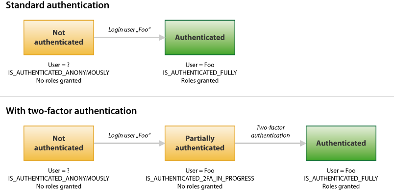

scheb/two-factor-bundle
=======================

This bundle provides **two-factor authentication for your Symfony application**.

## Index

- [Installation](installation.md)
- [Configuration Reference](configuration.md)
- [Trusted Devices](trusted_device.md)
- [Backup Codes](backup_codes.md)
- [Brute Force Protection](brute_force_protection.md)
- [Events](events.md)
- [How to create a custom two-factor authenticator](providers/custom.md)
- [How to handle multiple activated authentication methods](multi_authentication.md)
- [How to create a custom persister](persister.md)

## Two-Factor Authentication Methods

The bundle supports the following authentication methods out of the box:

  - [Google Authenticator](providers/google.md)
  - [Email authentication code](providers/email.md)

See [Providers](providers/index.md) for more information about custom or third-party provider.

## The Authentication Process

The bundle hocks into security layer and listens for authentication events. When a login happens and the user has
two-factor authentication enabled, access and privileges are temporary withhold from the user. Instead, the user is
challenged to enter a valid two-factor authentication code. Only when that code is entered correctly, the roles are
granted.

To represent the state between login and a valid two-factor code being entered, the bundle introduces the role-like
attribute `IS_AUTHENTICATED_2FA_IN_PROGRESS`, which can be used in `is_granted()` calls. `IS_AUTHENTICATED_FULLY` is,
just like roles, withhold until the two-factor authentication step has been completed successfully.
